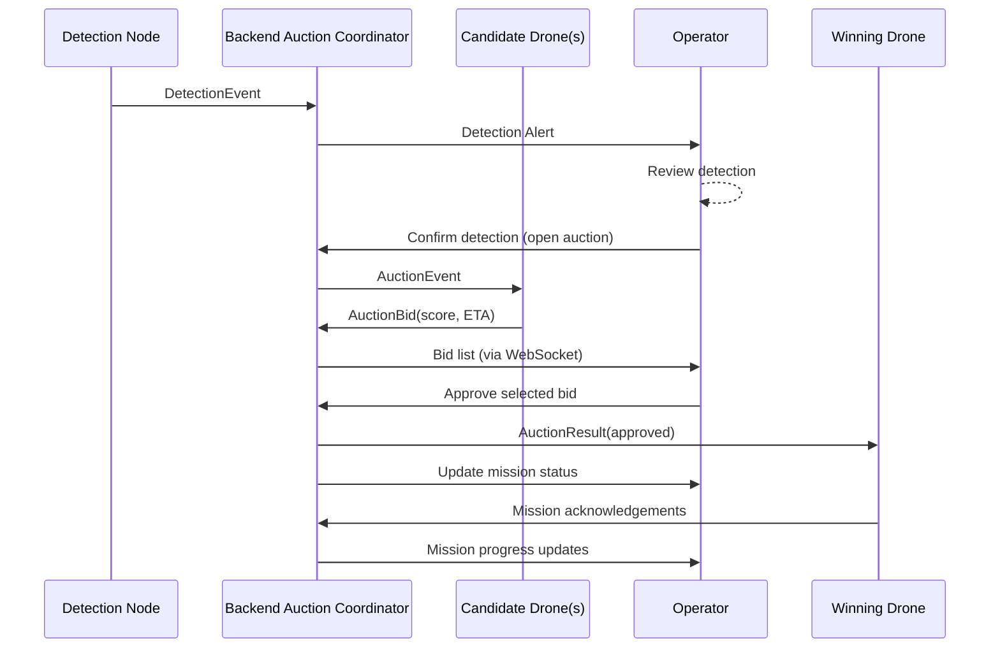

# System Architecture

This document captures the current end-to-end design for the ZWARM hobby drone swarm project, including how video, detection metadata, and task auctions flow between components.

## High-Level Components

```mermaid
graph LR
  subgraph Edge[Drones (per vehicle)]
    CAM[Camera Node]
    DET[Hailo Detector]
    PX4[PX4 Bridge]
    AUC_CL[Auction Client]
  end

  subgraph ROS2DDS[ROS 2 DDS Domain]
    CAM -->|sensor_msgs/Image| ROS_IMG[(Image Topic)]
    DET -->|vision_msgs/Detection2DArray| ROS_DET[(Detection Topic)]
    PX4 -->|zwarm_msgs/DroneStatus| ROS_STATUS[(Status Topic)]
    AUC_CL -->|AuctionBid| ROS_BID[(Auction Bids)]
    ROS_AUC[(Auction Events)] --> AUC_CL
  end

  subgraph Backend[Backend Bridge]
    BRIDGE[ROS 2 Bridge]
    API[REST/WebSocket API]
    AUC_COORD[Auction Coordinator]
  end

  subgraph Dashboard[Operator Dashboard]
    UI[Web UI]
    MEDIA[WebRTC Player]
  end

  ROS_IMG --> BRIDGE
  ROS_DET --> BRIDGE
  ROS_STATUS --> BRIDGE
  ROS_BID --> BRIDGE
  AUC_COORD --> ROS_AUC
  BRIDGE --> AUC_COORD

  BRIDGE -->|Video RTP/RTSP/WebRTC| MEDIA
  BRIDGE -->|Detection Metadata WS/DataChannel| UI
  API --> UI
  UI --> API
  AUC_COORD --> API
```

**Key ideas**
- Each drone runs ROS 2 nodes for camera capture, Hailo detection, PX4 telemetry, and auction participation.
- The ROS 2 DDS domain carries raw video frames, detection metadata, status heartbeats, and auction messages.
- The backend bridge subscribes to ROS 2 topics, forwards encoded video to the dashboard, exposes a REST/WebSocket API, and hosts the auction coordinator.
- The dashboard consumes the live stream, overlays detections from metadata, and keeps the operator in the loop for auction approvals.

## Video + Detection Synchronisation

We keep a single high-quality video stream while sending detection metadata out-of-band using timestamps. The dashboard overlays boxes client-side only when the timestamps match.

```mermaid
sequenceDiagram
  participant CAM as Camera Node
  participant DET as Detector Node
  participant ROS as ROS 2 Topics
  participant BE as Backend Bridge
  participant UI as Dashboard UI

  CAM->>ROS: Image(frame_id, stamp)
  DET-->>CAM: subscribe(Image)
  DET->>ROS: DetectionEvent(frame_id, stamp)
  ROS->>BE: Image(frame_id, stamp)
  ROS->>BE: DetectionEvent(frame_id, stamp)
  BE->>UI: Video Frame(frame_id)
  BE->>UI: Detection Metadata(frame_id)
  UI->>UI: Match frame_id; overlay boxes if metadata present
```

**Handling drift or drops**
- Video frames and detection metadata carry the same `frame_id` or timestamp copied from the original `sensor_msgs/Image` header.
- The backend/dashboard maintain a short-lived buffer keyed by `frame_id`. If metadata arrives late, the overlay appears on the next frame with the same identifier.
- Missing packets simply result in a frame without boxes; the stream never blocks waiting for metadata.

## Drone Auction Loop



**Notes**
- Auctions time out if no drone bids before the deadline; the operator is notified to retry or handle manually.
- Losing bidders receive a negative `AuctionResult` so they can clear any temporary state.
- The same message definitions in `packages/common/zwarm_msgs/` power the detector, backend, auction clients, and dashboard bridge.

## Future Extensions
- Embed detection metadata inside the encoded video stream (SEI NAL units or RTP header extensions) if tighter synchronisation is required.
- Support multiple ROS 2 domains (edge + ground) bridged by the backend once the fleet scales beyond the hobby setup.
- Add archival services (video recorder, detection history) once the core loop is stable.
